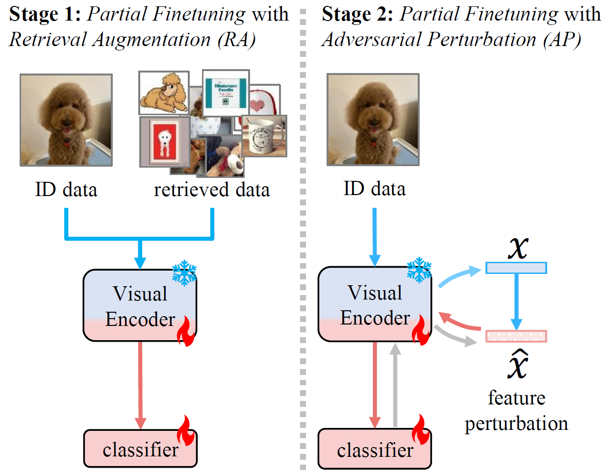
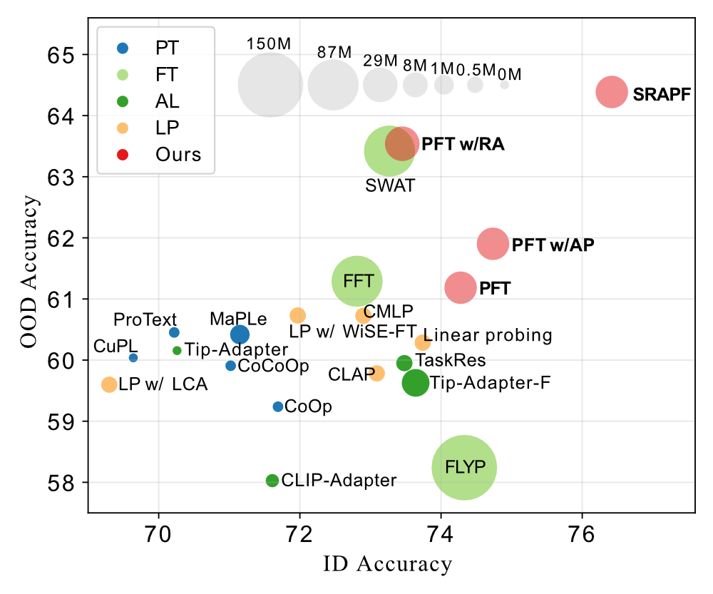

<div align='center'>
<h1>Robust Few-Shot Vision-Language Model Adaptation </h1>
	
<a href="https://hannawang09.github.io/" target="_blank">Hanxin Wang</a><sup>1,†</sup>,
<a href="https://tian1327.github.io/" target="_blank">Tian Liu</a><sup>2,†</sup>,
<a href="https://aimerykong.github.io/" target="_blank">Shu Kong</a><sup>1,3,*</sup>

<span><sup>1</sup>University of Macau,</span>
<span><sup>2</sup>Texas A&M University,</span>
<span><sup>3</sup>Institute of Collaborative Innovation</span>

 <sup>†</sup>Equal contribution, <sup>*</sup>Corresponding author
 
<a href="https://arxiv.org/abs/2506.04713"></a>
<a href="https://hannawang09.github.io/projects/srapf/"></a>
</div>


Pretrained Vision-Language Models (VLMs) achieve strong performance on downstream tasks when adapted with just a few labeled examples. However, the few-shot adapted models inevitably encounter out-of-distribution (OOD) test data that deviates from the in-distribution (ID) task-specific training data.

We propose **SRAPF**, **S**tage-wise **R**etrieval **A**ugmentation-based **A**dversarial **P**artial **F**inetuning, a robust few-shot VLM adaptation method. It consists of two finetuning stages: (1) partial finetuning of the visual encoder using both ID and retrieved data, followed by (2) adversarial partial finetuning using few-shot ID data. 

<div align='center'>
    
</div>

## Environment Configuration

You can run the command below to set up the environment in an easy way:

```
# Create a Virtual Environment
conda create -n srapf python=3.10
conda activate srapf
# Install Dependencies
pip install -r requirements.txt
```


## Dataset Preparation 

Please follow the instructions in [DATASET.md](DATASETS.md) to prepare the datasets used in the experiments.


## Demo

We provide demos of model training and evaluation. 

- See `PFT_demo.ipynb` for the details of **Partial Finetuning**.
- See `PFT_w_AP_demo.ipynb` for the details of **Partial Finetuning with Adversarial Perturbation**.
- See `SRAPF_demo.ipynb` for the details of **Stage-wise Retrieval Augmentation-based Adversarial Partial Finetuning**.


## Performance
<div align='center'>
    
</div>


## Todo

- [ ] add scripts


## Acknowledgments

Our code is built on [LCA-on-the-line(ICML'24)](https://github.com/ElvishElvis/LCA-on-the-line) and [SWAT(CVPR'25)](https://github.com/tian1327/SWAT).

We also thank [torchattacks](https://github.com/Harry24k/adversarial-attacks-pytorch) providing `attack.py` in our work.


## Citation

If you find our project useful, please consider citing:

```bibtex
@article{wang2025robust,
    title={Robust Few-Shot Vision-Language Model Adaptation}, 
    author={Wang, Hanxin and Liu, Tian and Kong, Shu},
    journal={arXiv preprint arXiv:2506.04713},
    year={2025}
}

@inproceedings{liu2025few,
  title={Few-Shot Recognition via Stage-Wise Retrieval-Augmented Finetuning},
  author={Liu, Tian and Zhang, Huixin and Parashar, Shubham and Kong, Shu},
  booktitle={Proceedings of the IEEE/CVF Conference on Computer Vision and Pattern Recognition (CVPR)},
  year={2025}
}
```

