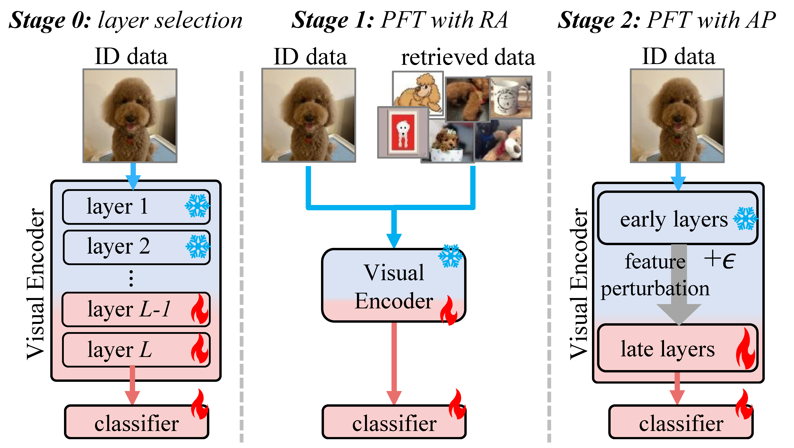
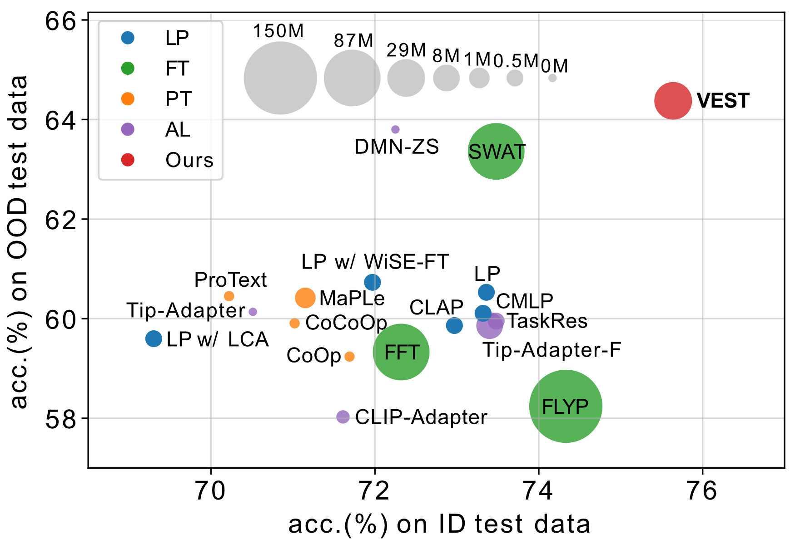

<div align='center'>
<h1>Enabling Validation for Robust Few-Shot Recognition</h1>
	
<a href="https://hannawang09.github.io/" target="_blank">Hanxin Wang</a><sup>1,\*</sup>,
<a href="https://tian1327.github.io/" target="_blank">Tian Liu</a><sup>2,\*</sup>,
<a href="https://aimerykong.github.io/" target="_blank">Shu Kong</a><sup>1,3</sup>

<span><sup>1</sup>University of Macau,</span>
<span><sup>2</sup>Texas A&M University,</span>
<span><sup>3</sup>Institute of Collaborative Innovation</span>

<sup>*</sup>Equal contribution
 
<a href="https://arxiv.org/abs/2506.04713"></a>
<a href="https://hannawang09.github.io/projects/vest/"></a>
</div>


Few-Shot Recognition (FSR) tackles classification tasks by training with minimal task-specific labeled data. Prevailing methods adapt or finetune a pretrained Vision-Language Model (VLM) generalizes decently well to the task-specific in-distribution (ID) test data but struggles with out-of-distribution (OOD) test data.

We introduce a novel validation strategy that harmonizes <em>performance gain</em> and <em>degradation</em> on the few-shot ID data and the retrieved data, respectively. Our validation enables parameter selection for partial finetuning and checkpoint selection, mitigating overfitting and improving test-data generalization. We unify this strategy with robust learning techniques into a cohesive framework: <b>V</b>alidation-<b>E</b>nabled <b>S</b>tage-wise <b>T</b>uning (<b>VEST</b>).


<div align='center'>
    
</div>


## Environment Configuration

You can run the command below to set up the environment in an easy way:

```
# Create a Virtual Environment
conda create -n vest python=3.10
conda activate vest
# Install Dependencies
pip install -r requirements.txt
```


## Dataset Preparation 

Please follow the instructions in [DATASET.md](DATASETS.md) to prepare the datasets used in the experiments.


## Training and Testing
1. Update your data path and retrieved data path in `config.yml`.
2. Runing script 
    - For **Validation-Enabled Stage-wise Tuning (VEST)**, use the following command:
    ```
    bash scripts/run_dataset_seed_VEST.sh imagenet [data_seed] [ft_top_X_block]
    
    # In our experiments, we PFT top-4 blocks on CLIP and top-1 blocks on DINOv2.
    ```
    - For **Partial Finetuning (PFT)**, use the following command:
    ```
    bash scripts/run_dataset_seed_PFT.sh imagenet [data_seed] [ft_top_X_block]
    ```
    - For **Partial Finetuning with Adversarial Perturbation (PFT w/ AP)**, use the following command:
    ```
    bash scripts/run_dataset_seed_PFT_w_AP.sh imagenet [data_seed] [ft_top_X_block]
    
    # In our experiments, we set eps to 3e-2 when partially finetuning the pretrained model and 7e-3 in stage-2 of VEST.
    ```
    
    > Note: The default model is CLIP. To finetune the DINOv2 model instead, please update the `model_cfg` in scripts.


## Demos
We provide demos of model training and evaluation. 

- See `PFT_demo.ipynb` for the details of **Partial Finetuning**.
- See `VEST_demo.ipynb` for the details of **Validation-Enabled Stage-wise Tuning**.
- See `VEST_dinov2_demo.ipynb` for the details of **Validation-Enabled Stage-wise Tuning** on vision foundation model DINOv2.


## Performance
<div align='center'>
    
</div>


## Acknowledgments

Our code is built on [LCA-on-the-line(ICML'24)](https://github.com/ElvishElvis/LCA-on-the-line) and [SWAT(CVPR'25)](https://github.com/tian1327/SWAT).

We also thank [torchattacks](https://github.com/Harry24k/adversarial-attacks-pytorch) providing `attack.py` in our work.


## Citation

If you find our project useful, please consider citing:

```bibtex
@article{wang2025enabling,
    title={Enabling Validation for Robust Few-Shot Recognition}, 
    author={Wang, Hanxin and Liu, Tian and Kong, Shu},
    journal={arXiv preprint arXiv:2506.04713},
    year={2025}
}

@inproceedings{liu2025few,
  title={Few-Shot Recognition via Stage-Wise Retrieval-Augmented Finetuning},
  author={Liu, Tian and Zhang, Huixin and Parashar, Shubham and Kong, Shu},
  booktitle={Proceedings of the IEEE/CVF Conference on Computer Vision and Pattern Recognition (CVPR)},
  year={2025}
}
```
